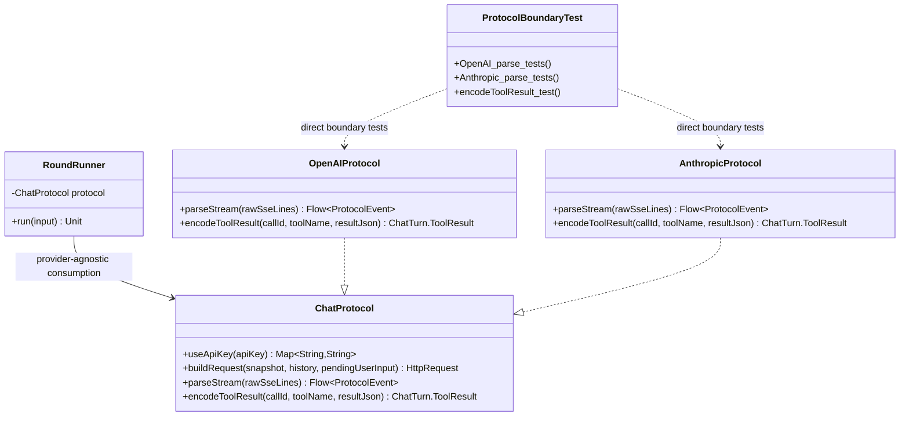

# 技术方案与 API 设计 v1.0

## 1. 架构特征分析
- **强制复用基础设施**: 继续复用 `ChatProtocol`、`ProtocolEvent`、`OpenAIProtocol`、`AnthropicProtocol`、`GsonJsonCodec`、Kotlin `runBlocking` + Flow 单元测试模式。
- **架构模式**: `RoundRunner` 只依赖 provider-agnostic `ChatProtocol`；provider-specific wire shape 保持在 `ext/protocol/openai` 与 `ext/protocol/anthropic` 子包。
- **依赖约束**: 不修改 `Session.open(...)`、`ProtocolRegistry`、`SessionProtocols`；协议实现禁止依赖 `ChatSession`；测试可以直接依赖具体 protocol 实现。
- **命名规范**: 测试新增 `ProtocolBoundaryTest`，测试方法继续使用中文反引号命名，和现有 `SessionFlowRegressionTest` 风格一致。
- **最小改动原则**: 生产代码默认不改；通过直接单测锁定现有协议行为；仅修正 ASC 文档状态不一致。

## 2. 审查发现 (Review Findings)
- **PM 缺口检查**: ASC-05 要求覆盖 OpenAI 普通文本、reasoning、tool call 分片、invalid frame；Anthropic text、thinking/signature、tool_use input_json_delta、error frame；`encodeToolResult` 行为。设计已全部映射到 `ProtocolBoundaryTest`。
- **架构一致性检查**: `ChatProtocol` 当前虽然包含 auth/request/parse/tool result，但这些职责都属于 provider adapter 边界。强行拆分会让 `RoundRunner` 或新 mapper/parser/encoder 承担 provider wire shape 知识，收益不足。
- **设计隔离检查**: `ProtocolBoundaryTest` 的职责是锁定 provider 协议边界行为；通过直接调用 `parseStream(...)` 和 `encodeToolResult(...)` 验证，不接入 `ChatSession` 或 `RoundRunner`。
- **红队修正**: 暂不新增 `ProtocolRequestContext`。`SessionSnapshot` 当前是不可变 round snapshot，不会把 `ChatSession` 可变状态泄漏进 protocol；新增 DTO 只会引入重复映射成本。

## 3. 设计决策记录
| 争议点 | 讨论摘要 | 最终选择 | 理由 |
|:-------|:---------|:---------|:-----|
| 是否拆分 `ChatProtocol` | A) 保持接口现状并补直接测试；B) 拆成 request/parser/encoder；C) 引入 `ProtocolRequestContext` | 选项 A | 当前真实风险是 wire behavior 无直接测试，不是协议接口失控；拆分会增加 provider wire shape 回归面 |
| 协议测试落点 | A) 单文件 `ProtocolBoundaryTest.kt`；B) 按 provider 拆两个 test；C) 扩展 `SessionFlowRegressionTest.kt` | 选项 A | 单文件能集中表达 ASC-05 的“边界复核”目的，避免污染 session flow 测试 |
| Request JSON shape 是否纳入本轮 | A) 暂不覆盖；B) 同时断言 buildRequest JSON | 选项 A | ASC-05 task 明确要求 stream parse 和 encodeToolResult；request JSON 断言会显著扩大范围且更脆弱 |

## 4. 方案概览
ASC-05 采用“生产边界保持 + 协议直接测试补强”的最小方案。不新增 mapper/parser/encoder，不新增 DTO，不修改协议注册。新增 `ProtocolBoundaryTest.kt` 直接实例化 `OpenAIProtocol(GsonJsonCodec())` 与 `AnthropicProtocol(GsonJsonCodec())`，通过 `flowOf(...)` 输入 provider SSE data JSON，并收集 `ProtocolEvent` 断言输出。另修正大 ASC `progress.md` 中 ASC-04 状态滞后，保证恢复流程不会误判前置门禁。

### 后续拆分触发条件
仅当满足以下任一条件时，后续 ASC 才应重新考虑拆分 `ChatProtocol`：
- 单个 provider protocol 文件超过 300 行，且 request build 与 stream parse 均持续增长。
- 新增第三个以上非 OpenAI-compatible provider，且出现重复 request/parse 子流程。
- `buildRequest` 或 `parseStream` 需要独立复用到非 `RoundRunner` 调用链。
- provider protocol 开始需要共享复杂状态，导致单测无法只通过 public method 覆盖。

## 5. 项目目录结构
```text
s3ss10n/
├── src/main/java/com/niki914/s3ss10n/
│   ├── ext/protocol/ChatProtocol.kt                  # 不改：保持协议边界接口
│   ├── ext/protocol/openai/OpenAIProtocol.kt         # 默认不改：通过测试锁定行为
│   ├── ext/protocol/anthropic/AnthropicProtocol.kt   # 默认不改：通过测试锁定行为
│   └── RoundRunner.kt                                # 不改：继续只消费 ProtocolEvent
└── src/test/java/com/niki914/s3ss10n/
    └── ProtocolBoundaryTest.kt                       # 新增：provider wire behavior 直接测试

docs/.asc_task/
├── session_architecture_refactor_05_protocol_boundary/
│   ├── tech_survey.md
│   ├── tech_design.md
│   ├── plan.md                                      # Phase 2 产出
│   └── progress.md
└── session_architecture_refactor_big_asc/
    └── progress.md                                  # 修改：修正 ASC-04/ASC-05 状态
```

**不会修改的范围**
- 不修改 `Session`、`ChatSession`、`SessionConfig`、`SessionSnapshot`。
- 不修改 `ProtocolRegistry`、`SessionProtocols`。
- 不修改 OpenAI/Anthropic 模型字段和 JSON wire shape。
- 不引入新的生产协议抽象类型。

## 6. 详细 API 设计

### Class: `ChatProtocol`
- **类型**: 保持不变
- **职责**: provider adapter 边界，封装 auth header、request build、stream parse、tool result encode。
- **隔离验证**: What=封装单个 provider 的 HTTP/stream/tool-result 协议适配 | How=`useApiKey/buildRequest/parseStream/encodeToolResult` | Depends=`SessionSnapshot`、`ChatTurn`、`HttpRequest`、`ProtocolEvent`

#### 保持签名
```kotlin
interface ChatProtocol {
    fun withCodec(codec: JsonCodec): ChatProtocol = this

    fun useApiKey(apiKey: String): Map<String, String>

    fun buildRequest(
        snapshot: SessionSnapshot,
        history: List<ChatTurn>,
        pendingUserInput: String?
    ): HttpRequest

    fun parseStream(rawSseLines: Flow<String>): Flow<ProtocolEvent>

    fun encodeToolResult(
        callId: String,
        toolName: String,
        resultJson: String
    ): ChatTurn.ToolResult
}
```

### Class: `ProtocolBoundaryTest`
- **类型**: 新增 test class
- **职责**: 直接锁定 OpenAI/Anthropic provider wire frame 到 `ProtocolEvent` / `ChatTurn.ToolResult` 的映射。
- **隔离验证**: What=验证协议边界行为 | How=直接调用 concrete protocol public methods | Depends=`OpenAIProtocol`、`AnthropicProtocol`、`GsonJsonCodec`、`ProtocolEvent`

#### 文件路径
```text
s3ss10n/src/test/java/com/niki914/s3ss10n/ProtocolBoundaryTest.kt
```

#### 测试方法（完整签名）
```kotlin
@Test
fun `OpenAI 普通文本 delta 解析为 TextDelta`(): Unit
```
- 输入：`{"choices":[{"delta":{"content":"hello"}}]}`
- 断言：输出包含 `ProtocolEvent.TextDelta("hello")`，最后为 `ProtocolEvent.Completed`。
- 覆盖：ASC-05 Required Test Case: OpenAI 普通文本 delta。

```kotlin
@Test
fun `OpenAI reasoning content 解析为 ReasoningDelta`(): Unit
```
- 输入：`{"choices":[{"delta":{"reasoning_content":"why"}}]}`
- 断言：输出包含 `ProtocolEvent.ReasoningDelta("why")`。
- 覆盖：ASC-05 Required Test Case: OpenAI reasoning content。

```kotlin
@Test
fun `OpenAI tool call arguments 分片累积到完整 JSON 后发出 ToolCallReady`(): Unit
```
- 输入：两帧 `tool_calls`，第一帧带 `id/name` 与 partial arguments，第二帧补齐 JSON。
- 断言：完整 JSON 前不发出 `ToolCallReady`；完整后发出 `ToolCallReady(callId = "call-1", toolName = "lookup", argumentsJson = "{\"query\":\"hi\"}")`。
- 覆盖：ASC-05 Required Test Case: OpenAI tool call arguments 分片累积。

```kotlin
@Test
fun `OpenAI invalid frame 解析为 Parse error`(): Unit
```
- 输入：非 JSON 或不可 decode 的 frame。
- 断言：输出包含 `ProtocolEvent.Error(stage = SessionEvent.Stage.Parse)`，最后仍发出 `ProtocolEvent.Completed`。
- 覆盖：ASC-05 Required Test Case: OpenAI invalid frame。

```kotlin
@Test
fun `Anthropic text delta 解析为 TextDelta`(): Unit
```
- 输入：`content_block_delta` + `delta.type = "text_delta"`。
- 断言：输出包含 `ProtocolEvent.TextDelta("hello")`。
- 覆盖：ASC-05 Required Test Case: Anthropic text delta。

```kotlin
@Test
fun `Anthropic thinking 和 signature delta 解析为 reasoning events`(): Unit
```
- 输入：`thinking_delta` 与 `signature_delta` 两帧。
- 断言：输出包含 `ProtocolEvent.ReasoningDelta("think")` 与 `ProtocolEvent.ReasoningSignature("sig")`。
- 覆盖：ASC-05 Required Test Case: Anthropic thinking delta 和 signature delta。

```kotlin
@Test
fun `Anthropic tool_use input_json_delta 累积到 content_block_stop 后发出 ToolCallReady`(): Unit
```
- 输入：`content_block_start(type=tool_use)`，两个 `input_json_delta`，`content_block_stop`。
- 断言：stop 后发出 `ProtocolEvent.ToolCallReady(callId = "toolu-1", toolName = "lookup", argumentsJson = "{\"query\":\"hi\"}")`。
- 覆盖：ASC-05 Required Test Case: Anthropic tool_use input_json_delta 累积。

```kotlin
@Test
fun `Anthropic error frame 解析为 Transport error`(): Unit
```
- 输入：`{"type":"error","error":{"message":"bad request"}}`。
- 断言：输出包含 `ProtocolEvent.Error(stage = SessionEvent.Stage.Transport, cause.message = "bad request")`。
- 覆盖：ASC-05 Required Test Case: Anthropic error frame。

```kotlin
@Test
fun `OpenAI 和 Anthropic encodeToolResult 保持透传行为`(): Unit
```
- 输入：两种 protocol 均调用 `encodeToolResult("call-1", "lookup", "{\"ok\":true}")`。
- 断言：均返回 `ChatTurn.ToolResult(callId = "call-1", toolName = "lookup", resultJson = "{\"ok\":true}")`。
- 覆盖：ASC-05 Required Test Case: `encodeToolResult` 行为不变。

#### 可选私有辅助方法
```kotlin
private fun collectOpenAIEvents(vararg frames: String): List<ProtocolEvent>
```

```kotlin
private fun collectAnthropicEvents(vararg frames: String): List<ProtocolEvent>
```

```kotlin
private fun assertCompleted(events: List<ProtocolEvent>): Unit
```

### File: `docs/.asc_task/session_architecture_refactor_big_asc/progress.md`
- **类型**: 修改文档
- **职责**: 修正大 ASC 进度状态，使其与 ASC-04 子 ASC 完成事实一致。
- **隔离验证**: What=流程状态修正 | How=仅修改 ASC-04/ASC-05 相关行 | Depends=`session_architecture_refactor_04_session_state/progress.md`、ASC-05 当前进度

#### 修改规则
```text
Current Task: ASC-05 in progress
ASC-04 Status: Completed
ASC-05 Status: In Progress
Notes: ASC-04 子 ASC 已 Phase 3 Completed；ASC-05 Phase 0/1 正在推进
```

## 7. 数据模型 / SQL Schema
- 不新增运行时数据模型。
- 不新增 SQL schema。
- 不新增 `ProtocolRequestContext`。
- 新增测试仅构造 JSON 字符串，不改变生产模型字段。

## 8. 架构图 (Mermaid)


## 9. 行为保持矩阵
| 场景 | 当前行为 | 设计后行为 | 验证方式 |
|:-----|:---------|:-----------|:---------|
| 协议注册 | `SessionProtocols` 委托具体 protocol 并注册到 `ProtocolRegistry` | 不变 | 不修改相关文件 |
| OpenAI text delta | `content` -> `ProtocolEvent.TextDelta` | 不变 | `ProtocolBoundaryTest` |
| OpenAI reasoning | `reasoning_content` -> `ProtocolEvent.ReasoningDelta` | 不变 | `ProtocolBoundaryTest` |
| OpenAI tool call | 分片 arguments 完整 JSON 后 emit ready | 不变 | `ProtocolBoundaryTest` |
| Anthropic thinking/signature | 分别映射 reasoning delta/signature | 不变 | `ProtocolBoundaryTest` |
| Anthropic tool_use | `content_block_stop` 后 emit ready | 不变 | `ProtocolBoundaryTest` |
| Tool result encode | 两 provider 均返回 `ChatTurn.ToolResult` 透传 | 不变 | `ProtocolBoundaryTest` |

## 10. 实施约束
- `ProtocolBoundaryTest.kt` 只能调用 protocol public API，不反射访问 private accumulator。
- 测试输入必须是 `parseStream(...)` 的直接契约：`SseLineParser` 之后的 data JSON 字符串。
- 不为测试修改生产模型字段或放宽可见性。
- 不新增生产抽象类型。
- 不在 ASC-05 中补 request JSON shape 断言，除非 Phase 3 reviewer 发现当前测试无法覆盖验收标准。
