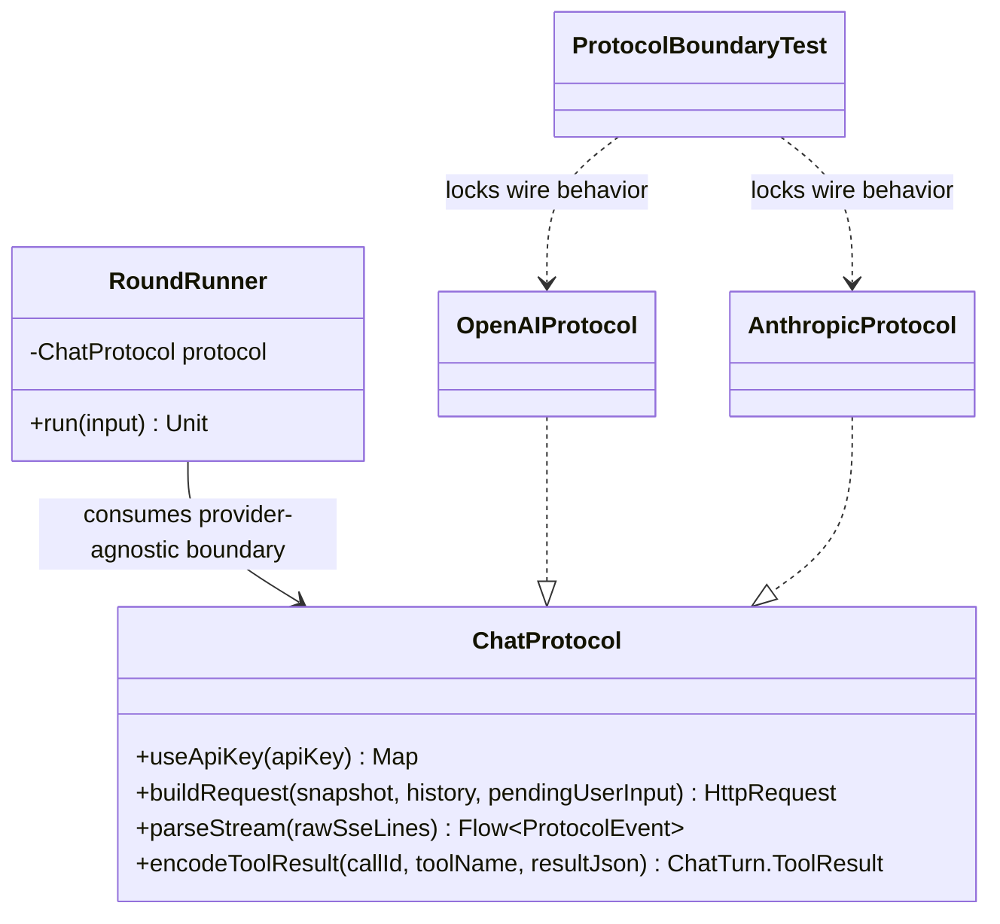

# 技术调研报告 v1.0

## 1. 需求概要

### 1.1 项目背景与目标
ASC-05 聚焦 `ChatProtocol` 协议边界复核，目标是防止协议层在 ASC-03/04 后成为新的厚接口，同时避免为了“拆分感”引入无收益的 provider wire shape 重构。本轮默认不改变 `Session.open(...)`、协议注册方式、模型字段和 JSON wire shape。

### 1.2 核心功能清单
| 编号 | 功能名称 | 描述 | 优先级 |
|:-----|:---------|:-----|:-------|
| F-01 | 协议边界评估 | 评估 `ChatProtocol` 当前职责是否需要拆分，并记录后续触发拆分条件 | P0 |
| F-02 | 协议直接测试补强 | 为 OpenAI/Anthropic 的 stream parse 与 tool result encode 增加直接单测 | P0 |
| F-03 | 大 ASC 状态修正 | 修正大 ASC `progress.md` 中 ASC-04 滞后状态，保证 ASC-05 前置门禁可追溯 | P1 |

### 1.3 约束条件
- **技术约束**: 不改变 `Session` 公开 API，不改变 `ProtocolRegistry` 注册方式，不改变 OpenAI/Anthropic JSON wire shape。
- **架构约束**: 协议实现不得依赖 `ChatSession`；`RoundRunner` 不得知道 provider-specific 细节。
- **流程约束**: ASC-05 需在 ASC-04 完成后串行推进；若发生源码变更，必须先补测试并经 reviewer 审查。

### 1.4 验收标准
| 编号 | 验收项 | 通过条件 |
|:-----|:-------|:---------|
| AC-01 | 不拆决策记录 | `tech_design.md` 明确记录暂不拆 `ChatProtocol` 的理由与后续拆分触发条件 |
| AC-02 | OpenAI 解析覆盖 | 单测覆盖普通文本 delta、reasoning content、tool call arguments 分片累积、invalid frame -> `ProtocolEvent.Error(Parse)` |
| AC-03 | Anthropic 解析覆盖 | 单测覆盖 text delta、thinking/signature delta、tool_use input_json_delta 累积、error frame -> `ProtocolEvent.Error(Transport)` |
| AC-04 | Tool result 行为 | 单测锁定 `encodeToolResult` 对 `callId/toolName/resultJson` 的透传行为 |
| AC-05 | 边界不反向依赖 | `OpenAIProtocol`、`AnthropicProtocol`、`ChatProtocol` 不依赖 `ChatSession` |

### 1.5 非功能性需求
- **稳定性**: 单测必须直接覆盖 provider wire frame，降低后续协议调整的回归概率。
- **可维护性**: 不新增无明确收益的 mapper/parser/encoder 类型。
- **兼容性**: 保持当前 Kotlin/JVM unit test 结构，不引入外部测试框架。

## 2. 需求澄清记录
| 轮次 | 问题 | 用户回答 |
|:-----|:-----|:---------|
| Q1 | ASC-05 协议边界策略选哪一个：保持现状+补测试、轻量拆分、中间 DTO？ | 选择“保持现状+补测试” |

## 3. 审查摘要 (Quality Assurance)
- **PM 确认**: ASC-05 的目标不是制造新抽象，而是确认协议边界不会侵蚀 `RoundRunner`/`ChatSession`，并用测试锁定 provider-specific 行为。
- **架构师修正**: 当前 `ChatProtocol` 虽包含 auth/request/parse/tool result 四类职责，但仍是 provider 级内聚边界；拆成 mapper/parser/encoder 会触碰 JSON wire shape，收益不足。
- **规范合规**: 已完成代码摸底，未跳过 Phase 0；前置 ASC-04 子进度显示已完成，大 ASC 进度滞后需修正。

## 4. 选型对比表 (Technology Comparison)
| 技术方案 | 成熟度 | 社区活跃度 | 性能表现 | 学习曲线 | 结论 |
|:---------|:-------|:----------|:---------|:---------|:-----|
| 方案 A: 保持 `ChatProtocol` 现状并补直接测试 | 高，复用现有结构 | 不涉及外部社区 | 无额外转换成本 | 低 | 推荐 |
| 方案 B: 轻量拆分 request/parser/encoder | 中，需要新增内部类型 | 不涉及外部社区 | 基本无运行时收益，增加调用层 | 中 | 排除，当前收益不足 |
| 方案 C: 引入 `ProtocolRequestContext` 中间 DTO | 中，需要维护 DTO 映射 | 不涉及外部社区 | 增加一次转换，收益依赖未来复杂度 | 中 | 暂缓，当前 `SessionSnapshot` 未泄漏可变状态 |

## 5. 现状映射表 (Context Map)
| PRD 功能点 | 现有代码逻辑/类 | 匹配度 | 备注 |
|:-----------|:---------------|:-------|:-----|
| 协议抽象边界 | `ChatProtocol` | 复用 | 唯一协议接口，未依赖 `ChatSession` |
| OpenAI 请求构建 | `OpenAIProtocol.buildRequest`、`OpenAIModels.kt` | 复用 | provider wire shape 内聚在 OpenAI 子包 |
| OpenAI stream parse | `OpenAIProtocol.parseStream`、`ToolCallAccumulator` | 补测试 | 当前缺少直接测试覆盖 reasoning、tool arguments 分片、invalid frame |
| Anthropic 请求构建 | `AnthropicProtocol.buildRequest`、`AnthropicModels.kt` | 复用 | provider wire shape 内聚在 Anthropic 子包 |
| Anthropic stream parse | `AnthropicProtocol.parseStream` | 补测试 | 当前缺少直接测试覆盖 thinking/signature、tool_use input_json_delta、error frame |
| 协议运行入口 | `RoundRunner.doRound` | 复用 | `RoundRunner` 只消费 `ProtocolEvent`，未包含 provider 细节 |
| session 门面 | `ChatSession` | 复用 | 当前约 117 行，已不直接出现协议解析细节 |

## 6. 决策记录 (Decision Log)
| 决策点 | 讨论摘要 | 最终选择 | 理由 |
|:-------|:---------|:---------|:-----|
| Protocol boundary strategy | A 保持现状+补测试 vs B 轻量拆分 vs C 中间 DTO | 方案 A | 现有 `ChatProtocol` 仍保持 provider 级内聚；当前真实缺口是直接协议测试不足，而不是接口不可维护 |

## 7. 方案概要
- **选定方案**: 保持 `ChatProtocol` 现状并补直接协议测试。
- **核心思路**: 不拆分生产协议接口；新增 OpenAI/Anthropic 协议单测锁定 parse 与 encode 行为；在设计文档记录后续拆分触发条件。
- **YAGNI 删减**: 暂不新增 `ProtocolRequestMapper`、`ProtocolStreamParser`、`ProtocolToolResultEncoder`、`ProtocolRequestContext`。
- **备选方案**: 轻量拆分和中间 DTO 均保留为后续触发条件满足后的方案，不在 ASC-05 当前实现。

## 8. 详细变更方案 (Detail Plan)

### 8.1 核心类修改
- `ChatProtocol.kt`: 默认不修改；若 Phase 1 发现必须补充注释，也仅限文档化职责，不改签名。
- `OpenAIProtocol.kt`: 默认不修改生产逻辑；通过新增测试锁定当前行为。
- `AnthropicProtocol.kt`: 默认不修改生产逻辑；通过新增测试锁定当前行为。
- `ProtocolBoundaryTest.kt`: 新增测试文件，直接实例化 `OpenAIProtocol`/`AnthropicProtocol` 并收集 `ProtocolEvent`。
- `docs/.asc_task/session_architecture_refactor_big_asc/progress.md`: 修正 ASC-04/ASC-05 状态，消除前置门禁记录不一致。

### 8.2 业务流程
1. Phase 1 在 `tech_design.md` 明确“暂不拆”的边界与触发条件。
2. Phase 2 将实现拆成测试补强和文档状态修正两个原子任务。
3. Phase 3 先新增协议直接测试，再进行最小必要文档修正。

## 9. 架构建模 (Mermaid)

## 10. 难点预判与风险
| 风险项 | 严重度 | 缓解策略 |
|:-------|:-------|:---------|
| Gson 对内部 data class 默认值/nullable 字段序列化影响断言 | P1 | 测试聚焦输出 `ProtocolEvent` 和 `ChatTurn.ToolResult`，避免脆弱断言全部 request JSON |
| Anthropic SSE event 行已被 `SseLineParser` 剥离，只剩 data JSON | P1 | 单测直接传入 data JSON flow，符合 `parseStream` 输入契约 |
| OpenAI tool call arguments 以 JSON 完整性判定 ready | P1 | 用两段 partial arguments 断言只在 JSON 完整后发出 `ToolCallReady` |
| 大 ASC `progress.md` 状态滞后导致后续恢复误判 | P1 | 将状态修正作为 ASC-05 文档任务处理 |

## 11. 开放问题
| 编号 | 问题 | 影响范围 | 状态 |
|:-----|:-----|:---------|:-----|
| Q-01 | 是否需要同时断言 request build JSON shape？ | 协议测试范围 | 暂不纳入 ASC-05 P0，避免扩大范围 |
